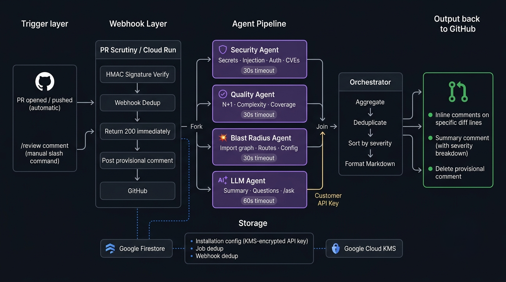

<div align="center">


**AI-powered code review that actually digs deeper.**

PR Scrutiny is a GitHub App that runs parallel specialist agents on every pull request — security, code quality, blast radius, and AI summary — and posts structured review comments directly on your diff.

[](https://www.typescriptlang.org/)
[](https://cloud.google.com/run)
[](./tests)
[](./LICENSE)

<br/>

[**🚀 Install on GitHub**](https://github.com/apps/pr-scrutiny/installations/new) &nbsp;&nbsp;·&nbsp;&nbsp; [**🌐 Live site**](https://pr-scrutiny-ty7nkvdzfq-uc.a.run.app) &nbsp;&nbsp;·&nbsp;&nbsp; [**📖 Docs**](./docs/in-details.md)

</div>

---

<!-- Replace with generated architecture diagram -->


---

## What it does

PR Scrutiny installs on your GitHub org and reviews every PR automatically. It runs four specialist agents in parallel — each focused on one dimension of code quality — and posts inline comments on specific lines plus a structured summary. Static agents (Security, Quality, Blast Radius) use zero LLM calls; only the AI Summary agent uses your API key.

**You keep full control:** bring your own Anthropic, OpenAI, or Google API key. It never touches your codebase beyond reading the diff.

---

## Slash Commands

Type any of these in a PR comment to trigger a review on demand:

| Command | What it does |
|---|---|
| `/review` | Full review — all four agents |
| `/review:security` | Security scan only |
| `/review:perf` | Code quality only |
| `/blast-radius` | Impact analysis — what else could break |
| `/summarize` | Plain-English AI summary of the PR |
| `/ask <question>` | Ask anything about the diff |
| `/re-review` | Re-run after you've pushed fixes |

PRs are also reviewed automatically when opened, pushed to, or reopened.

---

## How it works

### 1. Webhook received → 200 returned immediately

GitHub sends a webhook. PR Scrutiny validates the HMAC signature, deduplicates the delivery, and returns `200 OK` before doing any heavy work. A provisional comment (`🔍 PR Scrutiny is reviewing this PR...`) appears on the PR within ~1 second.

### 2. Context assembled from GitHub API

The Context Assembler fetches the full diff, changed file contents, 1-hop imports (for blast radius), repo tree, and existing comments. Diff size is capped at 25 files / 500 lines to keep agent runs bounded.

### 3. Four agents run in parallel

| Agent | Type | Timeout | What it checks |
|---|---|---|---|
| **SecurityAgent** | Regex + entropy | 30s | Hardcoded secrets, SQL/command injection, missing auth, dependency CVEs (OSV API) |
| **QualityAgent** | Heuristics | 30s | N+1 queries, cyclomatic complexity, missing test coverage, blocking I/O |
| **BlastRadiusAgent** | Import graph traversal | 30s | Affected files, routes, config changes, migration files, test gaps |
| **LLMAgent** | Vercel AI SDK | 60s | PR summary, clarifying questions, `/ask` answers |

If an agent times out, its findings are dropped and the others still post. No single agent can block a review.

### 4. Findings aggregated, formatted, posted

The Orchestrator merges all findings, deduplicates by `(file, line)` keeping the highest severity, sorts by `HOLD → WARN → SUGGEST → PASS → QUESTION`, and formats GitHub Markdown. Inline comments are batched into a single API call. The provisional comment is deleted.

### Severity levels

| Label | Meaning |
|---|---|
| `HOLD` | Blocking — do not merge without fixing |
| `WARN` | Likely bug or risk — review carefully |
| `SUGGEST` | Optional improvement |
| `PASS` | Looks good |
| `QUESTION` | Clarification needed from the author |

---

## Configuration

Add a `.pr-scrutiny.yml` to the root of any repo to customize behavior:

```yaml
# .pr-scrutiny.yml

# Paths to skip entirely
ignore_paths:
  - "*.generated.ts"
  - "dist/**"
  - "migrations/**"

# Minimum severity to post (HOLD | WARN | SUGGEST | PASS | QUESTION)
min_severity: WARN

# Disable auto-review on PR open/push (slash commands still work)
auto_review_on_ready: false

# Disable specific agents
disabled_agents:
  - LLMAgent

# Override LLM provider for this repo (uses installation default if not set)
llm_provider: anthropic
```

All fields are optional. Without a config file, defaults apply (all agents enabled, `SUGGEST` and above shown, auto-review on).

---

## Tech Stack

| Layer | Choice |
|---|---|
| Runtime | Google Cloud Run (Node.js 22, scales to zero) |
| Language | TypeScript 5, ESM |
| HTTP server | Hono |
| LLM SDK | Vercel AI SDK (`ai`, `@ai-sdk/anthropic`, `@ai-sdk/openai`, `@ai-sdk/google`) |
| GitHub API | Octokit |
| Storage | Google Firestore (Native mode) |
| Encryption | Google Cloud KMS (AES-256, customer API keys) |
| Secrets | Google Secret Manager |
| CI/CD | Google Cloud Build |
| Testing | Vitest (222 tests — unit + integration) |

---

## Contributing

### Running locally

```bash
git clone https://github.com/paramjeetn/pr-scrutiny
cd pr-scrutiny
npm install

# Copy env template and fill in values
cp .env.example .env

# Run agents against a local fixture (no GitHub connection needed)
npx tsx src/cli.ts tests/fixtures-data/pr-001-hardcoded-secret review

# Run all tests
npm test

# Run only unit tests (no API calls)
npm test -- --run tests/security tests/quality tests/blast-radius tests/orchestrator
```

### Running integration tests

Integration tests hit the real GitHub API and LLM providers. They require:

```bash
GITHUB_TOKEN=ghp_...          # Personal access token with repo scope
OPENAI_API_KEY=sk-...         # For LLM agent integration tests
```

Then:

```bash
npm test -- --run tests/github tests/llm
```

### Adding a new agent

1. Create `src/agents/<name>/index.ts` — export `run(job: ReviewJob): Promise<AgentResult>`
2. Add the agent name to `AGENT_REGISTRY` in `src/orchestrator/dispatcher.ts`
3. Wire it into `src/orchestrator/router.ts` for the relevant commands
4. Add tests in `tests/<name>/`

Agents receive a `ReviewJob` and return `AgentResult`. They must never call GitHub directly — all context is pre-loaded into `ReviewJob` by the Context Assembler.

### Project structure

```
src/
  agents/
    security/       # Secrets, injection, auth, CVE scanning
    quality/        # Logic bugs, complexity, coverage, performance
    blast-radius/   # Import graph, route/config classification
    llm/            # Summary, questions, /ask via Vercel AI SDK
  orchestrator/     # Router, dispatcher, aggregator, formatter
  github/           # Auth (JWT), context assembler, comment poster
  webhook/          # Handler, HMAC, parser, idempotency
  storage/          # Firestore, KMS, installations, jobs
  setup/            # Setup page handler + HTML
  landing/          # Landing page HTML
  types/index.ts    # All shared TypeScript types
  server.ts         # Hono app entrypoint
  cli.ts            # Local CLI runner
tests/              # 222 tests across 14 files
docs/               # Architecture, decisions, progress
```

---

## License

MIT — see [LICENSE](./LICENSE)

---

<p align="center">
  Built by <a href="https://github.com/paramjeetn">@paramjeetn</a>
</p>
